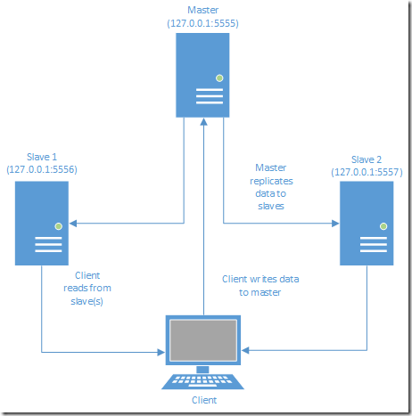

# Trambo

In this exercise first we create a stack in opsworks in aws, before create a layer in the stack

In the steps in lifecycle in opsworks we configure the diferent nodes with redis, the first instance is the master node and, if I insert a new instance in this layer the node will become a slave node 

# Attributes


Location for file.conf
``` 
default[:redis][:conf_dir]          = "/etc/redis"
```

Location for file.pid, this file are for execute daemon redis
```
default[:redis][:pid_file]          = "/var/run/redis.pid"
```


# Recipes

## Setup
### Setup.rb

Install redis server and configure the file.conf 

 
Installing AWS SDK whith next code 
```
gem_package 'aws-sdk' do
  action :install
end
```


## Configuration
### Configuration.rb

In this recipe are betwen the diference master and slave, first push master ip in dynamo DB for add before to node salaves 
If the ip aren't in the dynamo will be insert whith this command

```

    resp = dynamodb.put_item({
      item: {
        "role" => "master",
        "ip" => node['ipaddress'], 
        "host" => node['hostname'] 
      },  
      table_name: "chef-joseph" 
    }) 
```


Before copy file.conf, the server redis will reload whit this code
```
      execute 'redis-slave' do
        command "redis-server /etc/redis/redis.conf"
        user 'root'
      end
```


## Diagram of the architecture


